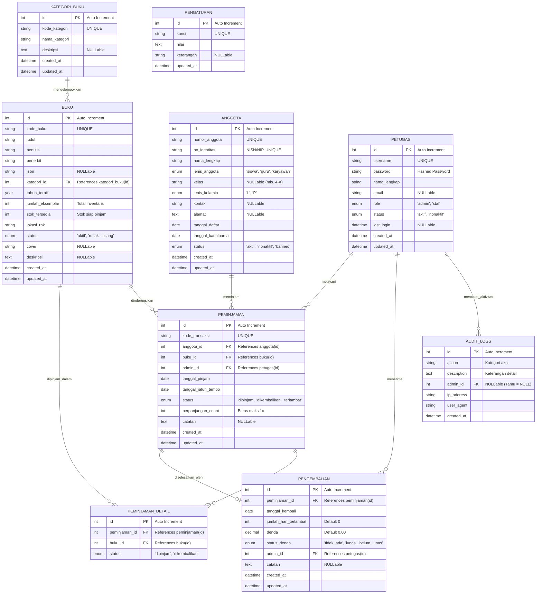
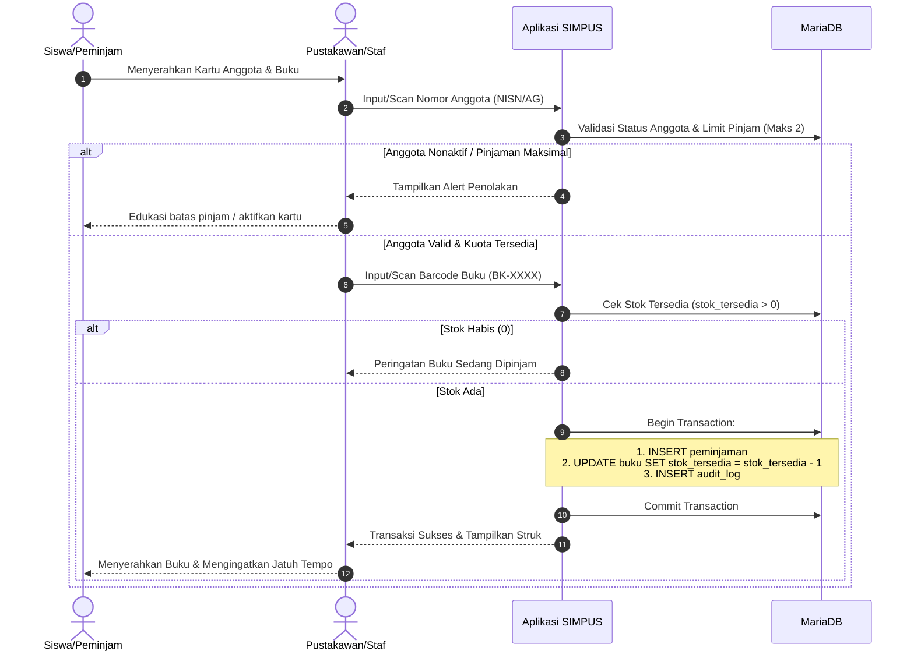
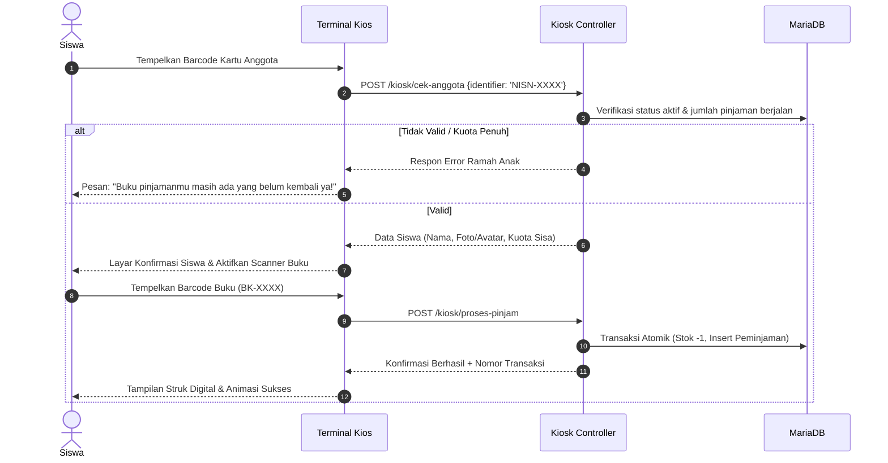
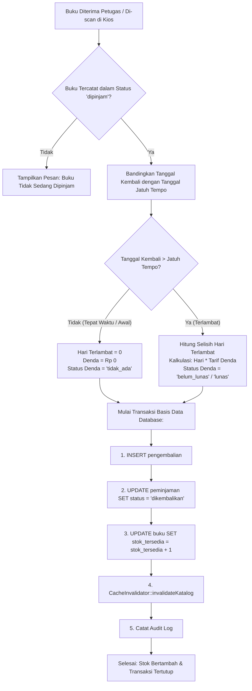
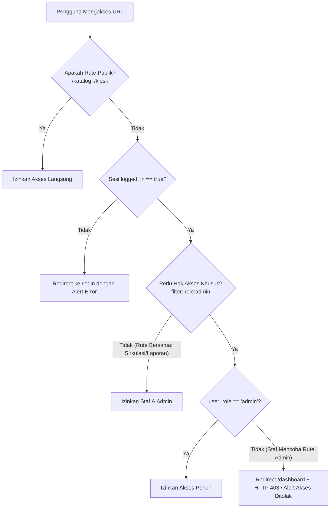

# DOKUMENTASI TEKNIS SISTEM
## SIMPUS — Sistem Informasi Manajemen Perpustakaan Terpadu
**Lampiran Tugas Akhir / Proyek Pengembangan Perangkat Lunak**

---

## 1. Ringkasan Eksekutif & Spesifikasi Teknologi

SIMPUS (Sistem Informasi Manajemen Perpustakaan Terpadu) adalah aplikasi berbasis web yang dirancang khusus untuk memenuhi kebutuhan sirkulasi, inventarisasi, dan layanan mandiri siswa di lingkungan perpustakaan sekolah dasar. Aplikasi ini mengintegrasikan meja sirkulasi konvensional dengan **Terminal Kios Mandiri (Self-Service Kiosk)** ramah anak serta **Katalog Terbuka Publik (OPAC)** tanpa login.

### Spesifikasi Stack Teknologi:
| Komponen | Teknologi / Versi | Fungsi Utama |
|---|---|---|
| **Bahasa Pemrograman** | PHP 8.2+ (ZTS Visual C++ 2019 x64) | Bahasa server utama berkinerja tinggi |
| **Framework Backend** | CodeIgniter v4.7.4 | Arsitektur MVC, Middleware Filter, Service Container |
| **Basis Data** | MariaDB 10.4 / MySQL 8.x (Port 3307) | Relational Database Management System (InnoDB Engine) |
| **Frontend Styling** | Vanilla CSS + TailwindCSS Design System | Desain modern responsif dengan Mode Terang & Gelap |
| **Pustaka Ikon** | Lucide Icons v0.468.0 (Self-Hosted) | Ikon grafis konsisten dengan CDN Fallback |
| **Visualisasi Data** | Chart.js v4.4.7 | Grafik statistik transaksi dan tren peminjaman |
| **Dialog Interaktif** | SweetAlert2 v11.14.5 | Modal konfirmasi atomik dan alert interaktif |
| **Barcode Engine** | JsBarcode v3.11.5 | Render barcode CODE128 untuk kartu anggota & buku |
| **Ekspor Dokumen** | DomPDF v3.1 + Native HTML Generators | Ekspor laporan resmi ke format PDF, Excel, dan Word |
| **Testing Suite** | PHPUnit v10.5.64 + Custom Spark Runner | Unit test logika kritis dan QA regression master suite |

---

## 2. Entity Relationship Diagram (ERD) & Kamus Data

### Diagram Konseptual Relasi Basis Data (Mermaid)



---

## 3. Kamus Data Rinci (Data Dictionary)

### 3.1. Tabel `buku`
Menyimpan data master koleksi pustaka sekolah:
- **`id`**: INT(11) UNSIGNED, Primary Key, Auto Increment.
- **`kode_buku`**: VARCHAR(50), NOT NULL, UNIQUE (Format: `BK-XXXX`).
- **`judul`**: VARCHAR(255), NOT NULL, Judul buku lengkap.
- **`penulis`**: VARCHAR(150), NOT NULL, Nama pengarang buku.
- **`penerbit`**: VARCHAR(150), NOT NULL, Penerbit buku.
- **`isbn`**: VARCHAR(30), NULL, Nomor ISBN resmi 10 atau 13 digit.
- **`kategori_id`**: INT(11) UNSIGNED, Foreign Key ke `kategori_buku(id)`.
- **`tahun_terbit`**: YEAR(4), NOT NULL, Tahun terbitan.
- **`jumlah_eksemplar`**: INT(11), NOT NULL, Default: 1, Total buku fisik yang dimiliki.
- **`stok_tersedia`**: INT(11), NOT NULL, Default: 1, Jumlah buku yang sedang ada di rak dan siap dipinjam.
- **`lokasi_rak`**: VARCHAR(50), NOT NULL, Kode rak simpan (mis. `R-01-A`).
- **`status`**: ENUM('aktif', 'rusak', 'hilang'), Default: 'aktif'.
- **`cover`**: VARCHAR(255), NULL, Nama file gambar cover di folder `public/uploads/covers/`.

### 3.2. Tabel `anggota`
Menyimpan identitas anggota perpustakaan (siswa, guru, tenaga kependidikan):
- **`id`**: INT(11) UNSIGNED, Primary Key, Auto Increment.
- **`nomor_anggota`**: VARCHAR(50), NOT NULL, UNIQUE (Format: `AG-XXXX`).
- **`no_identitas`**: VARCHAR(50), NOT NULL, UNIQUE (NISN untuk siswa, NIP untuk guru).
- **`nama_lengkap`**: VARCHAR(150), NOT NULL, Nama lengkap anggota.
- **`jenis_anggota`**: ENUM('siswa', 'guru', 'karyawan'), Default: 'siswa'.
- **`kelas`**: VARCHAR(20), NULL, Jenjang kelas (mis. `1-A`, `4-B`).
- **`status`**: ENUM('aktif', 'nonaktif', 'banned'), Default: 'aktif'.
- **`tanggal_kadaluarsa`**: DATE, NOT NULL, Batas berlaku kartu keanggotaan.

### 3.3. Tabel `peminjaman` & `pengembalian`
Menyimpan jejak sirkulasi peminjaman dan penyelesaian:
- **`peminjaman.kode_transaksi`**: VARCHAR(50), UNIQUE (Format: `TRX-YYYYMMDD-XXXX`).
- **`peminjaman.tanggal_pinjam`**: DATE, Tanggal resmi buku dipinjam.
- **`peminjaman.tanggal_jatuh_tempo`**: DATE, Batas akhir pengembalian (default: `tanggal_pinjam + durasi_pinjam`).
- **`peminjaman.perpanjangan_count`**: INT(2), Default: 0, Maksimal 1 kali perpanjangan (durasi tambahan 7 hari).
- **`pengembalian.jumlah_hari_terlambat`**: INT(11), Selisih hari antara `tanggal_kembali` dengan `tanggal_jatuh_tempo`.
- **`pengembalian.denda`**: DECIMAL(10,2), Hasil kali `jumlah_hari_terlambat * tarif_denda_per_hari`.
- **`pengembalian.status_denda`**: ENUM('tidak_ada', 'lunas', 'belum_lunas').

---

## 4. Alur Bisnis Sistem (Business Workflows)

### 4.1. Alur Peminjaman Buku di Meja Petugas


### 4.2. Alur Peminjaman Mandiri di Terminal Kios Siswa


### 4.3. Alur Pengembalian Buku & Perhitungan Denda


### 4.4. Alur Perpanjangan Masa Pinjam (Maksimal 1 Kali)
Siswa diizinkan memperpanjang masa peminjaman dengan syarat:
1. Peminjaman belum melewati tanggal jatuh tempo (tidak berstatus `terlambat`).
2. Transaksi belum pernah diperpanjang sebelumnya (`perpanjangan_count = 0`).
3. Siswa tidak memiliki tunggakan denda atau penangguhan akun.
4. Tanggal jatuh tempo diperpanjang selama durasi standar (7 hari kalender) dan `perpanjangan_count` diperbarui menjadi `1`.

### 4.5. Alur Otentikasi & Pembatasan Hak Akses (RBAC)


---

## 5. Panduan Instalasi & Setup dari Nol (Reproducible Guide)

Dokumentasi ini menjamin pihak ketiga atau penilai tugas dapat menjalankan proyek ini dari awal secara lancar.

### 5.1. Kebutuhan Sistem Minimum
- Sistem Operasi: Windows 10/11, Linux (Ubuntu/Debian), atau macOS.
- Web Server: Apache 2.4+ (XAMPP / Laragon).
- PHP Version: PHP 8.2 atau lebih baru.
- Ekstensi PHP Wajib:
  - `php_mysqli`
  - `php_pdo_mysql`
  - `php_intl`
  - `php_mbstring`
  - `php_curl`
  - `php_gd`
  - `php_sqlite3` (untuk testing suite)
- Composer: Versi 2.5 atau lebih baru.

### 5.2. Langkah Setup Proyek

#### Langkah 1: Kloning / Unduh Repositori
Ekstrak atau letakkan repositori di direktori kerja, contoh:
```bash
d:\BELAJAR 6 SEPT 2026\Management-Perpustakaan
```

#### Langkah 2: Instalasi Dependensi Pustaka
Jalankan composer pada folder root:
```bash
composer install
```

#### Langkah 3: Konfigurasi Basis Data (`.env`)
Salin file `env` menjadi `.env` jika belum tersedia, lalu sesuaikan:
```ini
CI_ENVIRONMENT = production
app.baseURL = 'http://localhost:8080/'

# Konfigurasi Koneksi Database
database.default.hostname = 127.0.0.1
database.default.database = perpustakaan
database.default.username = root
database.default.password = ""
database.default.DBDriver = MySQLi
database.default.port = 3307

# Konfigurasi Testing In-Memory
database.tests.DBDriver = SQLite3
database.tests.database = :memory:
```

#### Langkah 4: Impor Skema Basis Data
Buka basis data MariaDB pada port 3307 dan buat skema:
```sql
CREATE DATABASE IF NOT EXISTS perpustakaan CHARACTER SET utf8mb4 COLLATE utf8mb4_unicode_ci;
```
Jalankan migrasi dan seeder bawaan melalui Spark:
```bash
php spark migrate
php spark db:seed MainSeeder
```

#### Langkah 5: Akun Bawaan untuk Pengujian
| Role | Username | Password Bawaan | Hak Akses |
|---|---|---|---|
| **Administrator** | `admin` | `admin123` | Akses penuh (Manajemen Staf, Pengaturan, Sirkulasi, Log) |
| **Pustakawan/Staf** | `petugas` | `petugas123` | Meja Sirkulasi, Katalog Buku, Anggota, Laporan |

#### Langkah 6: Menjalankan Server Aplikasi
Jalankan server pengembangan:
```bash
php spark serve --port=8080
```
Akses aplikasi melalui browser:
- **Katalog OPAC Terbuka**: [http://localhost:8080/katalog](http://localhost:8080/katalog)
- **Terminal Kios Siswa**: [http://localhost:8080/kiosk](http://localhost:8080/kiosk)
- **Portal Login Petugas**: [http://localhost:8080/login](http://localhost:8080/login)

#### Langkah 7: Menjalankan Uji Otomatis
Untuk memverifikasi keandalan seluruh fungsi sistem:
```bash
php spark test
```
Seluruh 25 test cases akan dieksekusi dengan status hijau (PASS).
